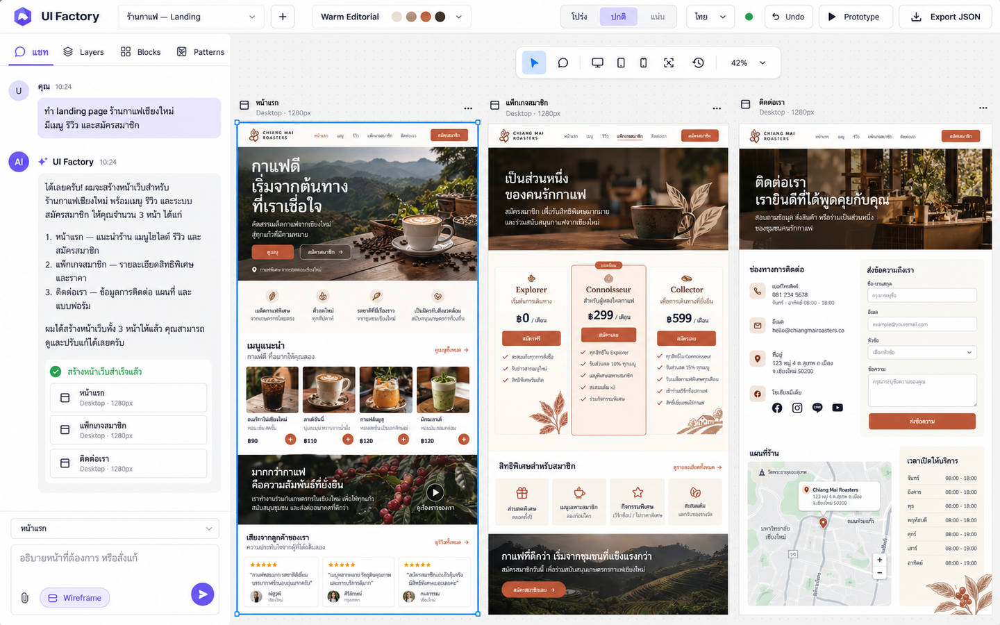
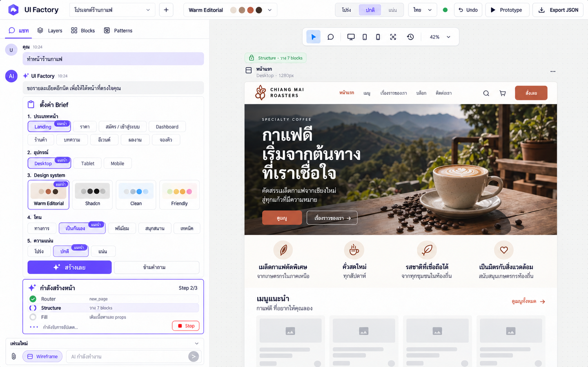
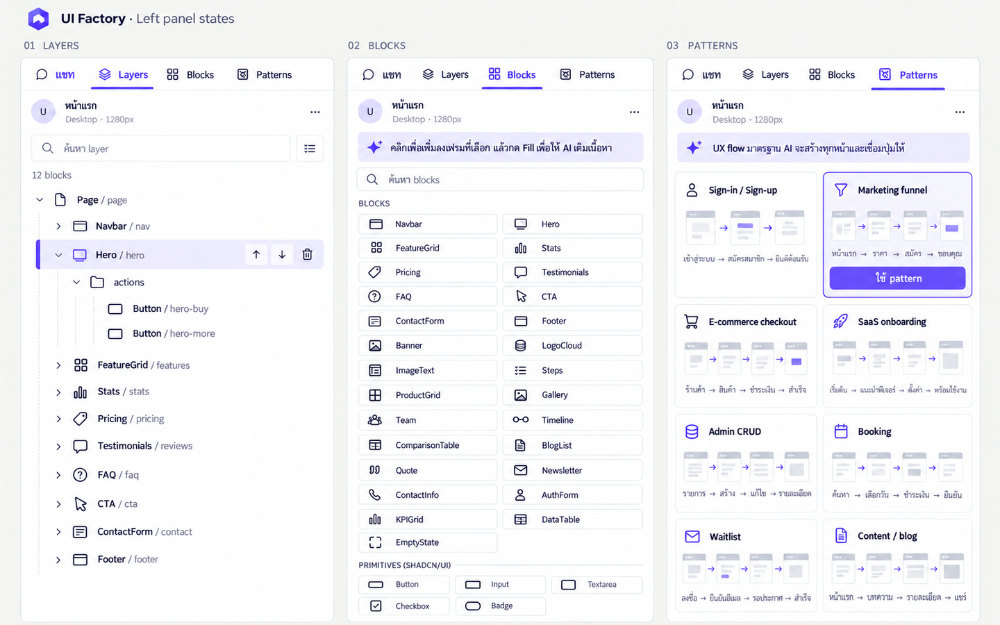
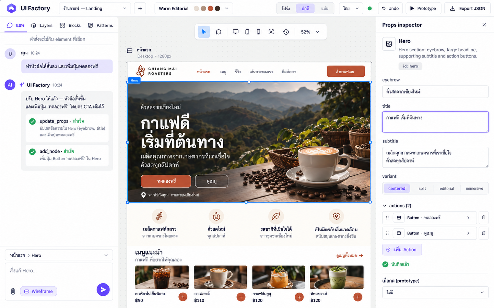
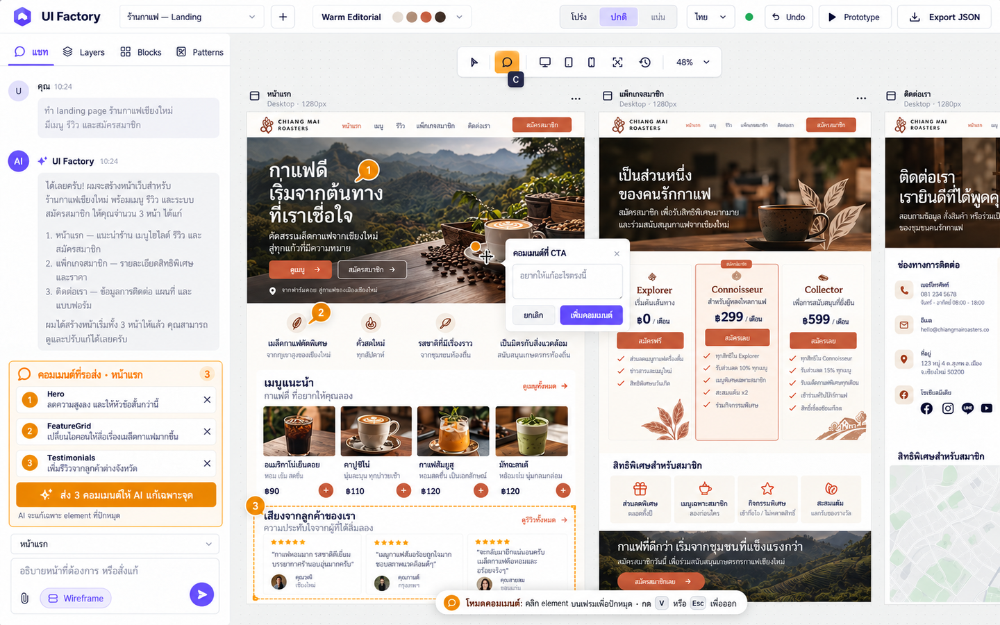
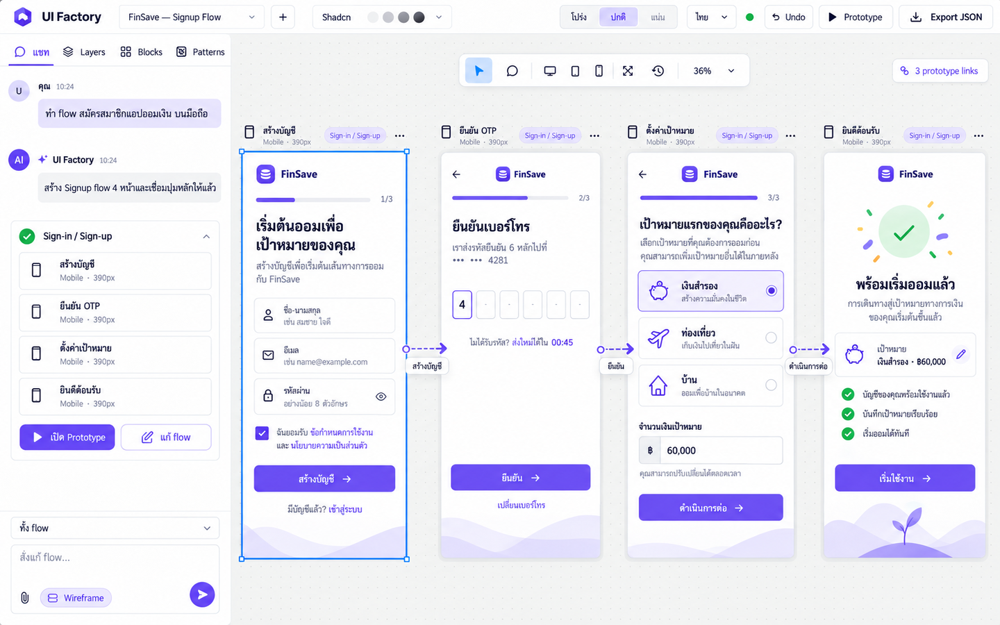
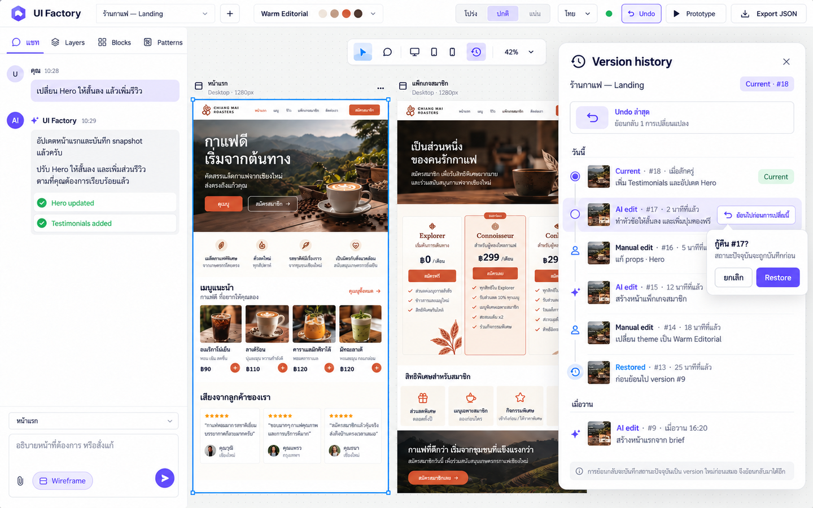
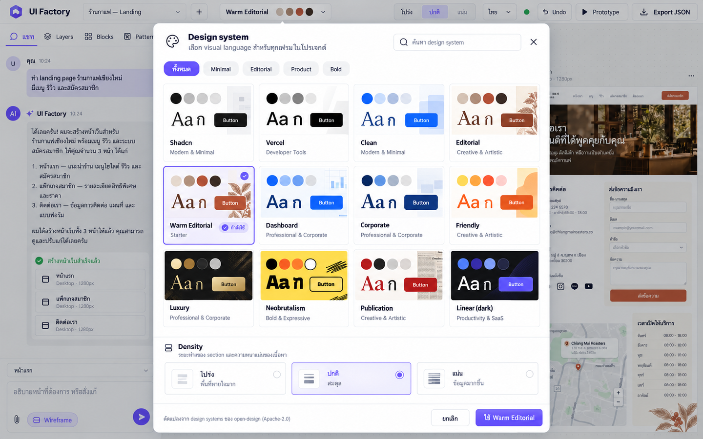
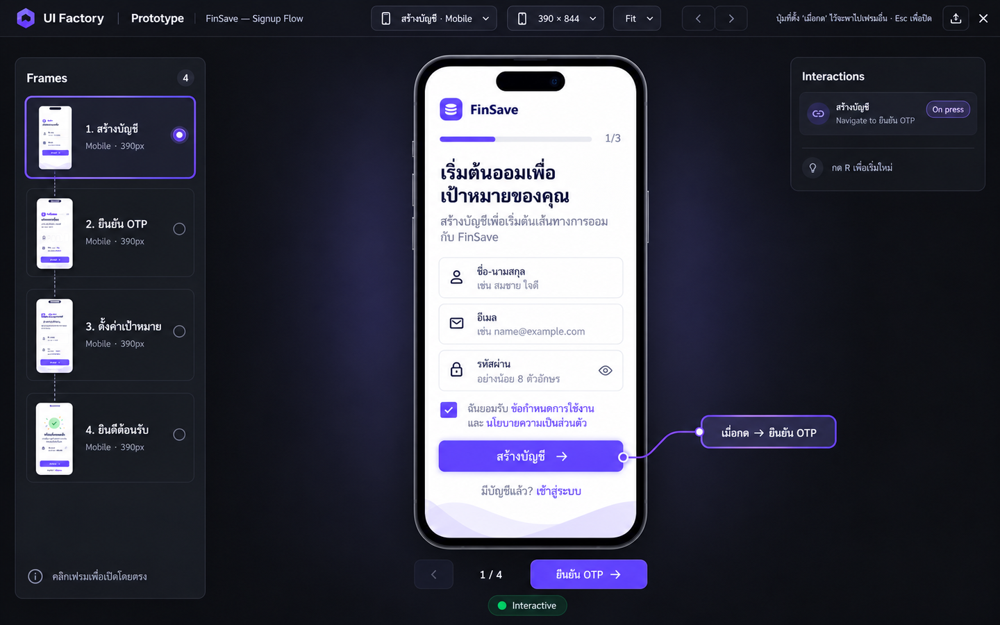

# UI Factory redesign mockups

High-fidelity 1440×900 redesign concepts for the current UI Factory editor. The visual system uses neutral tool chrome, crisp 1px borders, an 8px spacing grid, Inter / IBM Plex Sans Thai typography, and a restrained violet brand accent. Existing information architecture and product terminology are retained throughout.

## 01 — Editor overview

- Rebalances the existing editor into a compact top bar, a focused 400px chat rail, and a canvas that gives generated frames substantially more visual priority.
- Replaces broad elevation with hairline borders and neutral surfaces; violet identifies the brand and active controls, while blue remains reserved for canvas selection.
- Makes multi-page output easier to scan through consistent frame headers, device metadata, a selected-frame outline, and a compact floating canvas toolbar.

## 02 — Chat brief form

- Turns the clarification questions into one structured brief card with visible recommended defaults instead of an undifferentiated series of chips.
- Surfaces Router, Structure, and Fill as a persistent three-step progress model with current detail, streaming status, and a nearby Stop action.
- Keeps partial generation visible on the canvas so filled content and remaining skeleton blocks communicate progress together.

## 03 — Layers, Blocks, and Patterns

- Gives Layers a clearer tree hierarchy, stable indentation, selection treatment, search, counts, and contextual reorder/delete controls.
- Converts the Blocks catalog into compact scannable tiles while retaining the real Blocks and Primitives groupings and component names.
- Presents all eight flow patterns as visual mini-flows, making page sequence and the result of choosing a pattern understandable before insertion.

## 04 — Inspector selection

- Synchronizes the selected Hero across the canvas outline, chat scope, and inspector so users always know what an AI instruction or prop edit will affect.
- Gives schema-driven fields stronger grouping, readable labels, focus and saved states, and a compact treatment for nested action buttons.
- Preserves the rendered page as the center of attention while providing a full inspector without turning the editor into a dense settings dashboard.

## 05 — Comment mode

- Establishes amber as a dedicated comment-mode color across the toolbar, pins, target outline, queue, and mode instruction without competing with brand or selection colors.
- Anchors numbered pins directly to page elements and keeps the comment composer next to the target for stronger spatial context.
- Elevates batch review in the chat rail with removable items and one explicit “send 3 comments” action before AI edits begin.

## 06 — Flow canvas

- Uses four consistent mobile artboards to make the signup journey readable as a system rather than isolated screens.
- Labels connector arrows with the originating button text, clarifying both direction and the interaction that triggers navigation.
- Adds a compact flow summary and Prototype entry point in chat while leaving the canvas as the primary place for understanding relationships.

## 07 — Version history

- Keeps history as a floating canvas overlay so users retain page context while reviewing snapshots.
- Separates Current, AI edit, Manual edit, and Restored entries with a timeline, author icons, timestamps, descriptions, and optional thumbnails.
- Clarifies the difference between one-step Undo and restoring an older snapshot, including the recoverable-restore reassurance from the existing UI.

## 08 — Design system picker

- Expands the preset picker into a searchable comparison surface where all 12 real systems can be evaluated at once.
- Gives every card a compact color, typography, radius, and button preview rather than relying on a name and swatches alone.
- Brings density into the same decision surface with visual examples and plain-language descriptions, while clearly marking the active system and density.

## 09 — Prototype mode

- Creates a focused dark presentation environment that visually separates testing from editing while keeping UI Factory identity and controls recognizable.
- Adds direct frame navigation, current-frame context, pagination, and a sparse interaction summary around the clickable device preview.
- Makes the configured button-to-frame transition discoverable through a restrained hotspot callout without obscuring the prototype itself.

## Generation prompt set

The built-in image generation workflow used nine screen-specific `ui-mockup` prompts. Each prompt fixed the canvas at 1440×900, reused the same neutral/violet product-design system, required the labels and controls found in the React editor, and varied only the active screen state described by the corresponding section above. Screens 04–08 referenced the editor overview for visual continuity; screen 09 additionally referenced the signup-flow canvas for prototype content continuity.
